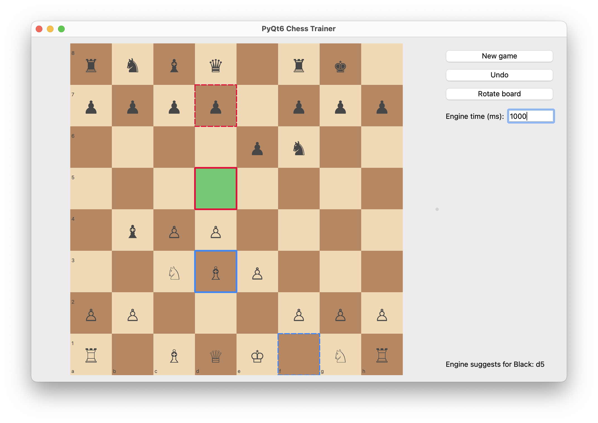

# PyQt6 Chess Trainer

## Description
**PyQt6 Chess Trainer** est une application légère d’entraînement aux échecs construite avec **PyQt6** et **python-chess**. Après chaque coup que vous jouez (blancs ou noirs), le système suggère immédiatement le meilleur coup pour le camp à jouer, en utilisant le moteur Stockfish.  
Vous gardez le contrôle total : le moteur ne joue jamais à votre place. Il met simplement en évidence sa réponse recommandée.

Ce dépôt GitHub constitue le support du code associé à un article soumis au magazine [*Programmez!*](https://www.programmez.com/). Les détails de publication (numéro et date de parution) seront ajoutés ici ultérieurement.

Fonctionnalités principales :
- Jouer manuellement en tant que blanc ou noir.  
- Voir immédiatement le meilleur coup de l’adversaire après votre coup.  
- Mise en évidence de votre dernier coup (bleu) et de la réponse suggérée par le moteur (rouge).  
- Temps de réflexion du moteur configurable.  

---

## Stockfish

### Qu’est-ce que c’est ?
**Stockfish** est l’un des moteurs d’échecs open-source les plus puissants. Il évalue les positions et suggère les meilleurs coups grâce au protocole **UCI** (Universal Chess Interface). L'application exécute Stockfish **en local**, ce qui permet un fonctionnement hors ligne et sans latence.  

### Installation

- **macOS (Homebrew) :**
  ```bash
  brew install stockfish
  ```

- **Linux (Debian/Ubuntu) :**
  ```bash
  sudo apt-get update
  sudo apt-get install stockfish
  ```

- **Windows :**
  Téléchargez un binaire précompilé depuis le [site officiel de Stockfish](https://stockfishchess.org/download/)  

---

## Installation

   ```bash 
   python3 -m venv .venv
   source .venv/bin/activate
   pip install -r requirements.txt
   ```

---

## Utilisation

1. Lancez l’application :
   ```bash
   python3 main.py
   ```

2. Jouez n’importe quel coup (en tant que blanc ou noir).  
   Le système mettra en évidence et affichera immédiatement le meilleur coup de l’adversaire.  

3. Utilisez les contrôles à droite :
   - **New game** : réinitialiser à la position initiale  
   - **Undo** : annuler votre dernier coup  
   - **Rotate board** : inverser l’orientation de l’échiquier  
   - **Engine time (ms)** : ajuster le temps de réflexion du moteur par coup  


