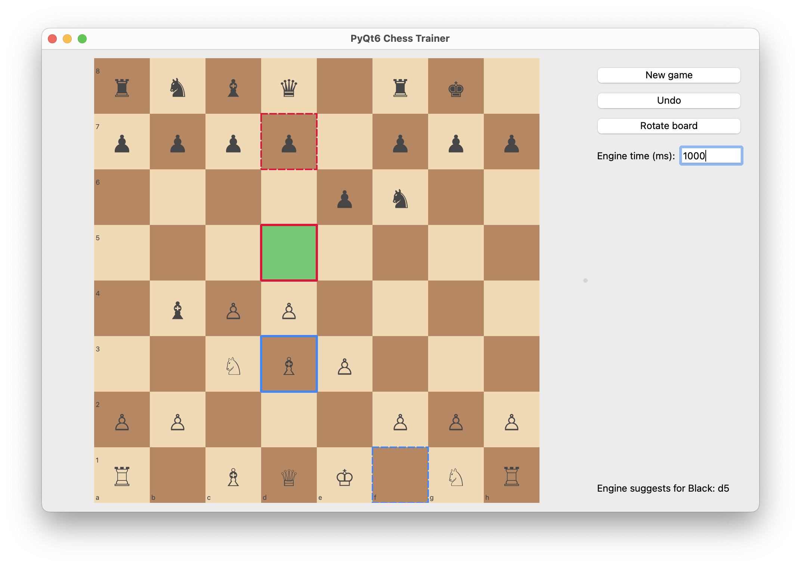

#### *Construire une application d’entraînement aux échecs avec PyQt6, python-chess et Stockfish*, 2025, *Programmez!* n°272, pp. 31-33.

---

##### Description
**PyQt6 Chess Trainer** est une application légère d’entraînement aux échecs construite avec **PyQt6** et **python-chess**. Après chaque coup joué, le système suggère immédiatement le meilleur coup du camp opposé (blanc ou noir) ceci en utilisant le moteur Stockfish.  


  
##### Stockfish

##### Installation

- **macOS (Homebrew) :**
  ```bash
  brew install stockfish
  ```

- **Linux (Debian/Ubuntu) :**
  ```bash
  sudo apt-get update
  sudo apt-get install stockfish
  ```

- **Windows :**
  Téléchargez un binaire précompilé depuis le [site officiel de Stockfish](https://stockfishchess.org/download/)  


##### Installation de l'application

   ```bash 
   python3 -m venv .venv
   source .venv/bin/activate
   pip install -r requirements.txt
   ```

##### Utilisation

1. Lancez l’application :
   ```bash
   python3 main.py
   ```

2. Jouez n’importe quel coup (en tant que blanc ou noir).  
   Le système mettra en évidence et affichera immédiatement le meilleur coup de l’adversaire.  

3. Utilisez les contrôles à droite :
   - **New game** : réinitialiser à la position initiale  
   - **Undo** : annuler votre dernier coup  
   - **Rotate board** : inverser l’orientation de l’échiquier  
   - **Engine time (ms)** : ajuster le temps de réflexion du moteur par coup  
